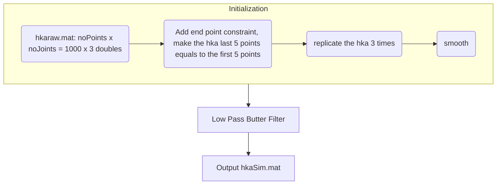
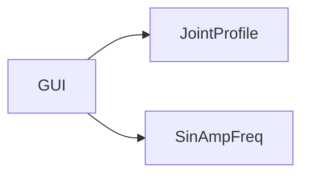

## Walking

- From Standing to Walking 



- Exo Simulation Initialization: Assign constants variables to workspace
  - **Bits Resolution**: Encoder, Control Signal, Msg Type
  - **Joint Data ID**: CAN Encoder & Motor Status & Torque &  Voltage/Current/Temperature
  - **CAN Node ID**: Main controller, Right & Left hip, Right & Left knee, Right & Left ankle
  - **Encoder Calibration**
  - **Encoder Offset**
  - **CAN message ID**: create bus object for CAN message
  - **Gait Profile Data**: `hkaSim.mat` (`structvar`)
    - Initial value for heel strike
    - Add transitions from standing still to walking (saved under `hka.signals.values`)
- Common practice (Rex paper, children, adult, Luu)
  - Standing 
  - Sitting
  - Walking
  - See what the sequence for rex
- To do
  - How to save this data to the main controller (as binary)
  - Read from main controller 
  - Compare data
- Torque, Rawan, database

## Trajectory Planning

```matlab
function trajPlanning()
clc;
close all;
% Input
q0 = 0;
v0 = 0;
q1 = 90;
v1 = 0;
constraint = [q0; v0; q1; v1];
Atransform = [2 1 -2 1;,...
              -3 -2 3 -1;,...
              0 1 0 0;,...
              1 0 0 0]
coeff = Atransform*constraint;
Fs = 200; % Hz
Ts = 1/Fs;
tdes = 2; % In second
Npoints = Fs*tdes;
tArray = linspace(0,1,Npoints);
for i = 1 : Npoints
    t = tArray(i);
    traj(i) = coeff(1)*t^3 + coeff(2)*t^2 + coeff(3)*t + coeff(4);    
end
subplot(4,1,1);
plot(tArray,traj);
subplot(4,1,2);
vel = diff(traj)/Ts;
plot(tArray(2:end),vel);
subplot(4,1,3);
acc = diff(vel)/Ts;
plot(tArray(3:end),acc);
subplot(4,1,4);
jerk = diff(acc)/Ts;
plot(tArray(4:end),jerk);

```

## Overview



