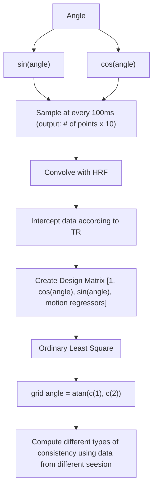

## Grid Cell for Conceptual Learning

- With great imagination,  [Constantinescu et al. (2016)](https://www.science.org/doi/abs/10.1126/science.aaf0941) proposed that the neuocortex may not only encode physical space, but also conceptual. 

- The experiement 

  - `# of participants`: 28 (men: 16; women: 12, mean age 26)

  - `Setup`: 

    - Noval 2D space of birds shapes were the leg and neck length of a simple silhouette drawing of a bird. And ther participants were not told there's a relationship between 
    - Navigate in the abstract space. Using keyboard button presses, subject learned to morph the bird, to explore the abstract space.

  - `Trajectory`: morph one bird to another

  - $\theta$ : 

    - $$
      \theta = \frac{\Delta neck}{\Delta leg}
      $$

  - Tasks: 

    - `Match Task`: use the controller to morph the bird on the left side to match the bird on the right side
      
    - `Explore Task`: participants are instructed to freely morphing the bird by choosing different ratio and see the necks and legs streches/shrink. When certain outcome (images of Santa Claus, a Christmas Tree, a gingerbread man, a sledge, a bell and a teddy-bear) reaches, the corresponding picture will pop up next to its associated bird. 
    - `Collect Task`: after the subjects knew the association between the stimulus and outcome relationship well, they will be asked to find the specific outcome by choosing the bird's neck:legs ratio only once 

### GLM Model for fMRI data

Dr Alexandra modeled the fMRI data with two GLMs (General Linear Models)

#### **GLM1**: hexagonal modulation analysis

- $n$: the modulation. For $n=6$, a periodicity of $60^\circ$
- $\theta(t)$: trajectory angle for each trial t within one session
- `Regressors`:  for n = 6, $sin(6\cdot\theta(t))$, $cos(6\cdot\theta(t))$
- `Coefficients`: $\beta_{sin}$ , $\beta_{cos}$ for $sin(6\theta)$, $cos(6\theta)$
- For the brain region that sensitive to the hexagonal symmetry, the regressors will produces coefficients with high amplitude as $\sqrt{\beta_{sin}^{2}+\beta_{cos}^{2}}$

With these two key regressors, followings are steps for determining ROI 

1. Use F-test to find ROI with two regressors: $\beta_{\sin }* \sin (6 \cdot \theta)+\beta_{\cos }*\cos (6 \cdot \theta)$

2. Transformed this statistic to a Z-statistic using an asymptotic approximation

- **Pros**: identify the periodic signal across whole brain without knowing the phase of the signals
- **Cons**: ==this test is unusual and should not be used for statistical inference because it can overestimate the Z-scores== (quote from supplementary material, don't fully understand)

#### GLM2: hexagonal consistency analysis

- $\theta(t)$: trajectory angle for each trial t within one session

- $φ$ : is the grid angle from another session acquired on the same day

- `parametric regressor` $cos(6[\theta(t) - φ])$, if the same grid angle show up in the other session, 

- Estimation of grid angle $φ$ 

  Similar to the one for navigating in physical space

  1. Average the coefficients for the $\beta_{sin}$ and  $\beta_{cos}$regressors across all voxels in the ROI
  2. Calculate grid angle $φ$ (varying between 0 and 59°) as $arctan [(\beta_{sin}/\beta_{cos})]/6 $

## Catch up

Pseudocode

```pseudocode
In:
	ts_seed: processed region of interest data 
	maineffectev: a table with value -- onset time | duration | val = 1
	angle: a table with value -- onset time | duration | angle 
	featdm: motion regressors
```





## Summary table of different modulations

### T-test

>Test statistics, returned as a structure containing the following:
>
>- `tstat` — Value of the test statistic.
>- `df` — Degrees of freedom of the test.
>- `sd` — Estimated population standard deviation. For a paired *t*-test, `sd` is the standard deviation of `x – y`.

>  **`p` — *p*-value scalar value in the range [0,1]**
>
>  *p*-value of the test, returned as a scalar value in the range [0,1]. `p` is the probability of observing a test statistic as extreme as, or more extreme than, the observed value under the null hypothesis. Small values of `p` cast doubt on the validity of the null hypothesis.

|                    | p      | h    | Ci              | Tstat   | df   | sd     |
| ------------------ | ------ | ---- | --------------- | ------- | ---- | ------ |
| **vmPFC, wd, m=4** | 0.3028 | 0    | -0.0006, 0.0020 | 1.0514  | 26   | 0.0033 |
| **vmPFC, wd, m=5** | 0.9036 | 0    | -0.0014, 0.0016 | 0.1223  | 26   | 0.0039 |
| **vmPFC, wd, m=6** | 0.0208 | 1    | 0.0003, 0.0038  | 2.4608  | 26   | 0.0043 |
| **vmPFC, wd, m=7** | 0.7637 | 0    | -0.0020, 0.0015 | -0.3039 | 26   | 0.0044 |
| **vmPFC, wd, m=8** | 0.7114 | 0    | -0.0010, 0.0014 | 0.3741  | 26   | 0.0031 |
| **ERH, wd, m = 4** | 0.6928 | 0    | -0.0027, 0.0040 | 0.3994  | 27   | 0.0086 |
| **ERH, wd, m = 5** | 0.1531 | 0    | -0.0043, 0.0007 | -1.4702 | 27   | 0.0064 |
| **ERH, wd, m = 6** | 0.0255 | 1    | 0.0003, 0.0048  | 2.3646  | 27   | 0.0058 |
| **ERH, wd, m = 7** | 0.4026 | 0    | -0.0038, 0.0016 | -0.8504 | 27   | 0.0069 |
| **ERH, wd, m = 8** | 0.9330 | 0    | -0.0023, 0.0021 | -0.0848 | 27   | 0.0056 |

#### Observation 

- `h` and `ci` are omitted from the t-test statistic, which all involves `Alpha`. (`Alpha` by default is `5`)

  ```matlab
  [~,p,~,stats]=ttest(diff);
  ```

- >`'Alpha'` — **Significance level `0.05` (default) | scalar value in the range (0,1)**
  >
  >Significance level of the hypothesis test, specified as the comma-separated pair consisting of `'Alpha'` and a scalar value in the range (0,1).
  >
  >**Example:** `'Alpha', 0.01`
  >
  >**Data Types:** `single` | `double`

  >`h` **— Hypothesis test result `1` | `0`**
  >
  >Hypothesis test result, returned as `1` or `0`.
  >
  >- If `h` `= 1`, this indicates the rejection of the null hypothesis at the [`Alpha`](https://localhost:31515/static/help/stats/ttest.html?snc=5X8K9Z&searchsource=mw&browser=F1help&container=jshelpbrowser#btqjrr4_sep_shared-Alpha)significance level.
  >- If `h` `= 0`, this indicates a failure to reject the null hypothesis at the `Alpha`significance level.

  >`ci` **— Confidence interval vector**
  >
  >Confidence interval for the true population mean, returned as a two-element vector containing the lower and upper boundaries of the 100 × (1 – [`Alpha`](https://localhost:31515/static/help/stats/ttest.html?snc=5X8K9Z&searchsource=mw&browser=F1help&container=jshelpbrowser#btqjrr4_sep_shared-Alpha?browser=F1help))% confidence interval.

- So, `h` and `ci` are added as the table shown above

### Bar Chart

- ​	**vmPFC, with-in day**

  - 
  - X-axis: degree (0 to 360)
  - Y-axis: Consistency effect size (a.u.)

- Compare between different m 
  

  - X - axis: value of m

  - Y - axis: bar size, avg of  

  - ```matlab
    % Calculate var
    %choose the consistency_type I'm interested in
    %exclude chosen subjects
    var=eval(['mm_' consist_type]); %e.g. consist_type = 'wd', var will be 'mm_wd', for vmPFC, mm_wd = 28 x 15, 28 person, 15 design matrix size
    var(exclude_subjs_ix,:)=[]; % remove the person exclude_subjs_ix, in this case, it is person # 27
    var(all(isnan(var),2),:)=[]; %remove nan rows (subjects who don't have that type of consistency; e.g. s01 doesn't have day2 data, so it can't have xd consistency)
    
    % calculation of diff, sem
    diff=nanmean((var(:,1:2:2*m) - var(:,2:2:2*m) ),2); % nanmean: mean ignore null values, get the odd num column of var and even num column of var
    [h,p,ci,stats]=ttest(diff);
    
    diff_mean=nanmean(diff);
    sem=nanstd(diff)/sqrt(size(diff,1));
    
    %plot control barplots
    figure('Position', [100, 100, 600, 400]); %fig size  
    bar(diff_all,'FaceColor',[0.7 0.7 0.7],'EdgeColor',[0 0 0],'LineWidth',1.5); hold on;   
    errorbar(diff_all,sem_all,'LineStyle','none','Color','k'); hold off;
    set(gca,'XTickLabel',['4';'5';'6';'7';'8']);
    end
    ```

  - `var` : 

    - `row`: patients id
    - `column`: GLM, parameters used in the design matrix. Used same day, first session data to evaluate the 2ns session of data. Then calculate the result of `OLS (ordinary least square)`, then get cope, and var

- **ERH**

  - ERH, within-day
    
  - Compare between different m
    

- **vmPFC, cross-day**

  - 
  - 

- **vmPFC -> vmPFC, with-day & cross-day**

  - 
  - 

- **ERH -> vmPFC, within-day, across-day**

  - 
  - 

