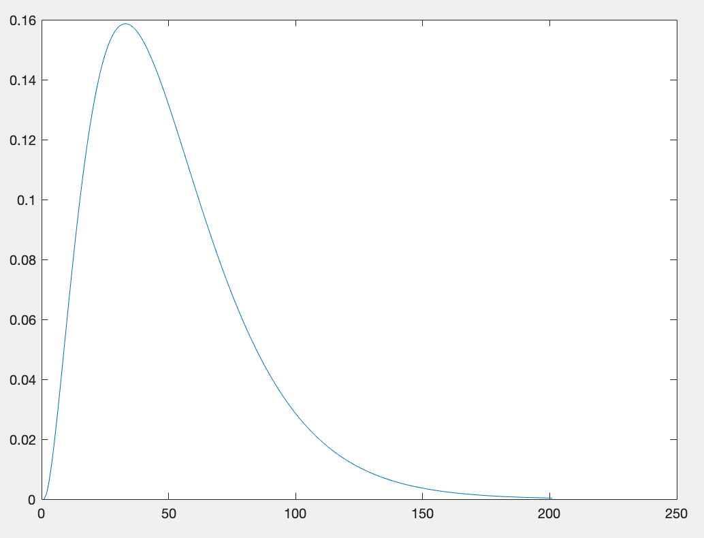
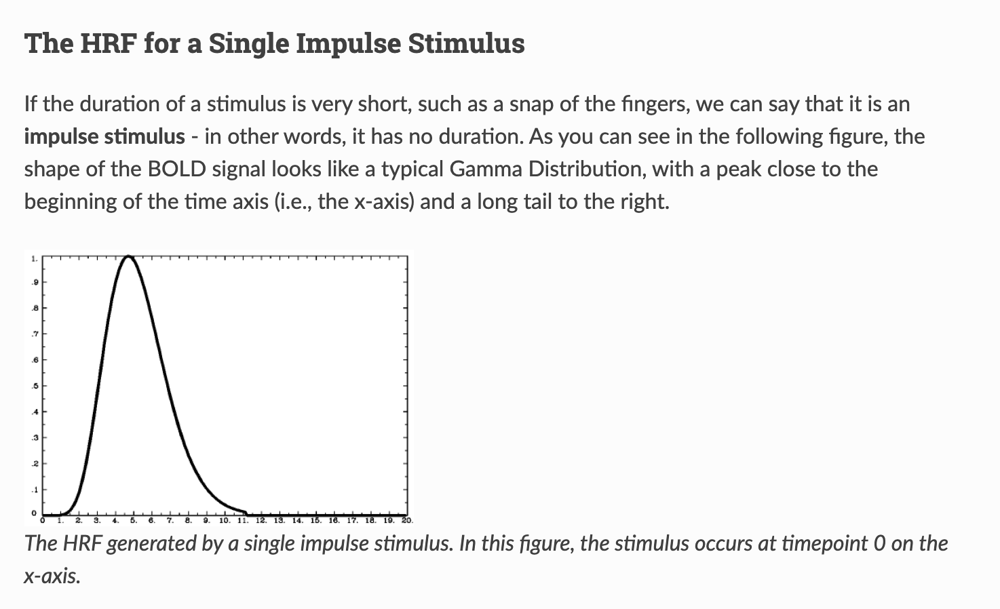
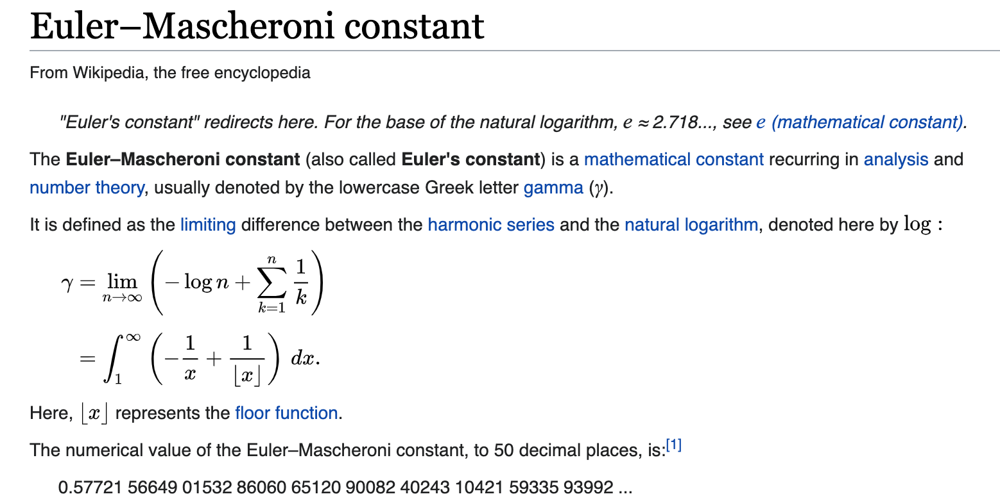
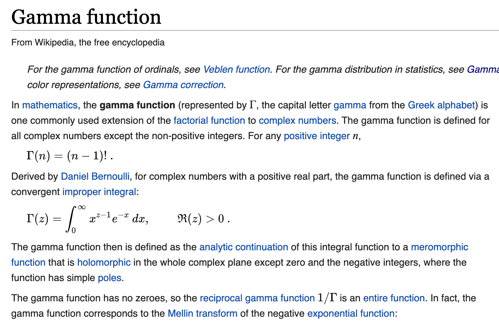
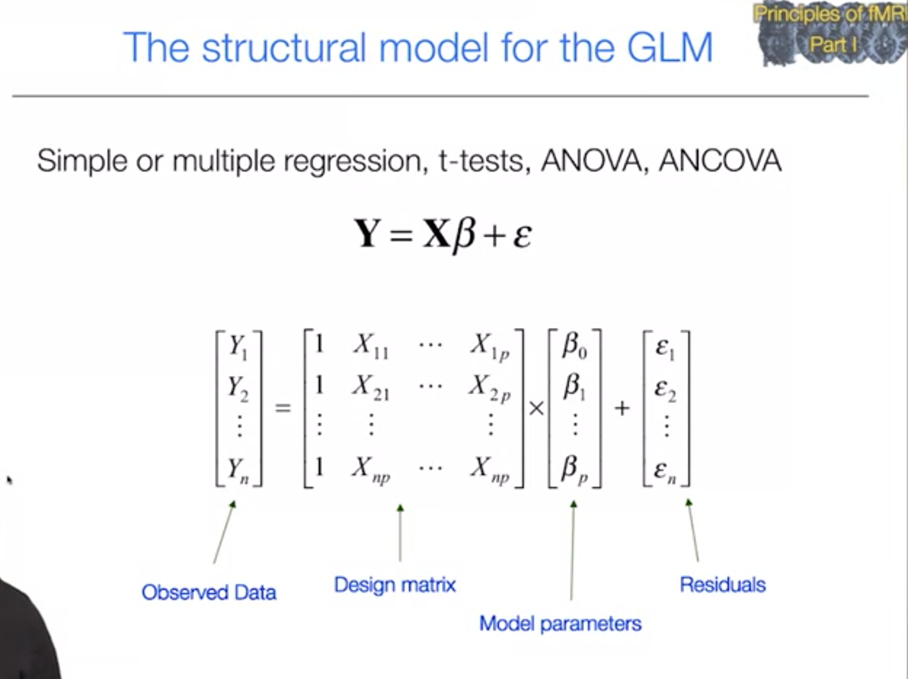

# fMRI basics study

## Resources

- Andy's Brain Book https://andysbrainbook.readthedocs.io/en/latest/index.html
- 

## First look on the data

### Key Concepts

- **TR** : time (in seconds) between scanning successive FMRI volumes.
- 

## Data Processing

#### `HRF`Hemodynamic Response Function

- plot $hrf=gammapdf(\alpha_1, \beta_1, t)$​;
  

- Why convolve with `Gamma distribution`?

  - BOLD (Blood oxygen level dependent) signal looks like a typical Gamma Distribution, this is used to identify the neuron firing
    

  - $\sigma = 3$

  - $my_1 = 5$

  - $\alpha_1 = {my_1}^2/\sigma^2 = 25/9$

  - $\beta_1 = {my_1}/\sigma^2 = 5/9$ 

  - t = [0, 0.1, 0.2, 0.3, 0.4, ..., 20]

  - $resolution = 0.1$

  - `gammapdf`:

    - $ \exp(a*log(b) + (a-1)*log(x) - b*x - \gamma \ln(a)) $
      $= e^{a*log(b)}*e^{(a-1)log(x)} * e^{-bx} * e^{-\gamma ln(a)}$

      $= b^a * x^{(a-1)} * e^{-bx}*\gamma ln(a)$

      $= b^a * x^{(a-1)} * e^{-bx}* \dfrac{1}{\Gamma(a)}$

    - Use $\alpha_1 = a, \beta_1 = b$, (==?== $\gamma ln(a) ==?\; \Gamma(a) ^ {-1}$)
      $$
      Gamma \; Distribution = \frac{x^{(\alpha_1-1)}\beta_1^{\alpha_1}e^{-\beta_1x}}{\Gamma(\alpha_1)}
      $$
      

      

    - >Evaluates a gamma of parameters a,b for all values in vector x
      >
      >Will have mean m and variance v: m = a/b; v = a/b^2;
      >
      >so, a = m^2/v; b = m/v;

    - mean = $\alpha_1/\beta_1$, variance = $\alpha_1/\beta_1^2$

    - PDF(probability distribution function)

      - for  $ x {\displaystyle \geq } 0$: 

#### Design Matrix

- https://fsl.fmrib.ox.ac.uk/fsl/fslwiki/FEAT/UserGuide#Appendix_B:_Design_Matrix_Rules
- 

#### T-Test

## ROI

How to find the Reigon of Interest
